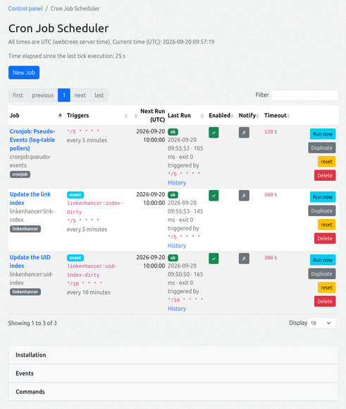
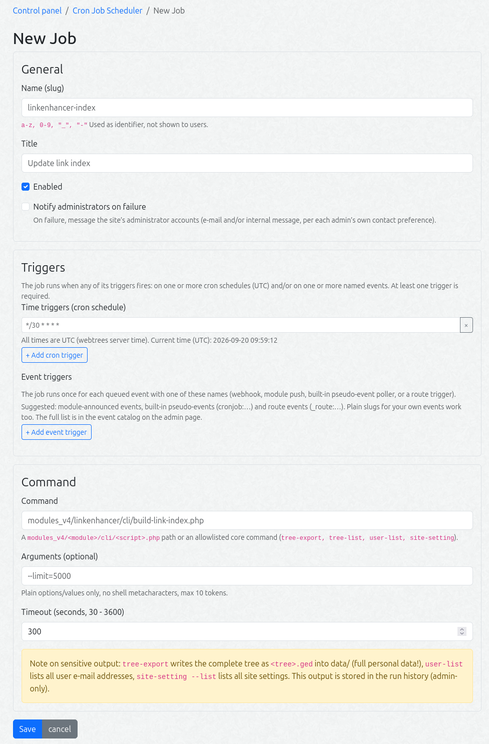

# webtrees module Cronjob

A **cron job scheduler service** for webtrees: schedule maintenance/batch jobs with
standard cron expressions, watch their run history in the admin UI, and trigger them
manually. The module is the *service*; the OS (classic cron or a systemd timer) only
has to call one small script once per minute.

- **Job registry + run history** in two own tables (`cj_job`, `cj_run`)
- **Admin UI** (control panel): job list, create/edit form, run history, run now, enable/disable, delete
- **Isolated execution**: every job runs as a separate child PHP process (`proc_open`, no shell), with per-job timeout and captured output
- **Self-registration**: other modules can advertise their jobs (a `cron-jobs.php` manifest or a `getCronJobs()` method); they appear here, created disabled and ready to enable
- **Event-driven jobs**: jobs can fire on events instead of a schedule - queued by a token-protected **webhook**, by a direct `EventQueue::push()` call from other modules, by the built-in **pseudo-event** pollers (the webtrees log table: failed logins, logins, logouts, errors, record edits, searches) or by **route events** (curated mutating editor routes)
- **Failure notification**: per-job opt-in to alert the site's administrator accounts (internal message and/or e-mail, per each admin's own preference) when a job fails
- **Offline awareness**: while `data/offline.txt` exists (e.g. during a webtrees update) the tick is skipped *before any database access* - no child process starts while migrations and code are in flux
- **No core changes, no changes to other modules**



It was originally developed as a support module for [LinkEnhancer](https://codeberg.org/bschwede/linkenhancer) to keep its indexes up to date.

## Requirements

- webtrees 2.2.x (PHP 8.3+)
- PHP CLI with `proc_open` available (standard)
- A trigger: classic cron, a systemd timer, a Windows Task Scheduler task,
  **or** the built-in watch daemon (no OS timer needed - see "Trigger installation")

## Installation

1. Copy the module folder to `modules_v4/cronjob/` (ZIP install works too).
   The cron library ships inside the module - nothing to fetch.
2. Open webtrees once (any page as an admin) so the module's `boot()` creates its tables.
3. Install the trigger (classic cron, systemd timer, or Windows Task Scheduler -
   the module's admin page (`Control panel → Cron Job Scheduler`) generates the
   block for your OS with the paths of *this* installation already filled in).
4. Create your first job in the admin UI.

## Usage

### Creating a job

`Control panel → Cron Job Scheduler → New Job`:

| Field | Meaning |
| :--- | :--- |
| **Name (slug)** | technical identifier, `a-z 0-9 _ -`. **Read-only for module-offered jobs** (their `<module>:<name>` key is fixed and cannot be retargeted); editable for jobs you create yourself. |
| **Title** | human readable name |
| **Triggers** | one or more **time triggers** (cron schedules) and/or one or more **event triggers** (runs when a named event is queued) - the job fires when *any* of its triggers fires. At least one trigger is required. Rows can be added/removed in the form. See "Event-driven jobs". |
| **Cron expression** | (time trigger) standard 5-field cron (`*/30 * * * *`), or a macro (`@daily`, `@weekly`, ...). Multiple cron rows are possible (e.g. hourly *and* a daily full run). **Times are UTC** (the webtrees server time basis - the same basis the core uses for all timestamps). The form previews the next 3 runs per expression. |
| **Event name** | (event trigger) the event this job reacts to, e.g. `linkenhancer:index-dirty`. Multiple event rows are possible. Suggestions come from the **event catalog** (module announcements, built-in pseudo-events `cronjob:…`, route events `_route:…` and listened names); any own name (webhook / direct module push) works too. Slug or `<domain>:slug`, max 64 chars. |
| **Command** | a `modules_v4/<module>/cli/<script>.php` path or an allowlisted core command: `tree-export`, `tree-list`, `user-list`, `site-setting`. Suggestions come from the **command catalog** (core allowlist + module announcements + module scripts). When the entered command matches an announced command, its **available parameters** are listed as a hint under the field. |
| **Arguments** | plain options/values only (e.g. `--limit=5000`), max 10 tokens |
| **Timeout** | 30 - 3600 s |
| **Notify on failure** | opt-in: alert the administrator accounts when this job fails |

The **Run now** button queues the job for the next tick (≤ 60 s). For a **disabled**
job the queued run happens at the first tick *after* it is (re-)enabled - the button
tooltip and the flash message say so (there is deliberately no guard: disabling the
job right after the click reaches the same state anyway). The **History** page shows
status, exit code, duration, the **trigger that fired the run** (the due cron
expression(s) or the event name) and the captured output (last 64 KB) of the last 25
runs per job (plus a 30-day global retention window).

The job table is a **client-side DataTable** (search box, sortable columns, paging,
state saved in the browser) - no extra setup needed. The **Enabled** and **Notify**
columns can be toggled in place (click the ✓/✗ button) without opening the form, and
the **Timeout** column shows each job's per-run timeout in seconds. Per row there are additional
actions: **Duplicate** opens the create form prefilled with a copy of the job
(new `-copy` slug, starts disabled; for module-offered jobs the `<module>:` name
prefix is removed, since the colon cannot be entered in the form), and **Reset**
(only for jobs offered by a module manifest) restores the module's currently-offered
defaults. If a save fails validation, the form is re-rendered with all entered
values kept (plus the error messages) - nothing you typed is lost.



### Trigger installation (once)

Pick **one** of the options shown in the module's admin page (classic cron, a
systemd timer, a Windows Task Scheduler task, or the built-in watch daemon):

**Option A - classic cron** (one line in the web server user's crontab, runs every
minute):

```
* * * * * cd "/path/to/webtrees" && mkdir -p data/cronjob && "/usr/bin/php" modules_v4/cronjob/cli/tick.php cron:tick >> "/path/to/webtrees/data/cronjob/tick.log" 2>&1
```

**Option B - systemd timer** (two unit files, also shown in the admin page):

```ini
# /etc/systemd/system/cronjob-tick.service
[Unit]
Description=webtrees cronjob module tick (runs due maintenance jobs)

[Service]
Type=oneshot
User=<webserver-user>
WorkingDirectory="/path/to/webtrees"
ExecStart="/usr/bin/php" ./modules_v4/cronjob/cli/tick.php cron:tick
```

```ini
# /etc/systemd/system/cronjob-tick.timer
[Unit]
Description=Run the webtrees cronjob tick every minute

[Timer]
OnBootSec=1min
OnCalendar=*:*:00
Persistent=true

[Install]
WantedBy=timers.target
```

```bash
sudo systemctl daemon-reload
sudo systemctl enable --now cronjob-tick.timer
```

**Option C - watch daemon** (no OS timer at all): click *Start watch* on the
admin page. A resident process then runs the tick every 60 seconds, and a
page-load watchdog respawns it if it dies. Use it when the host has no cron and
no systemd access — on Windows hosts this is the simplest option.

**Option D - Windows Task Scheduler** (Windows hosts, no cron/systemd): the
admin page generates the XML below with the paths of this installation already
filled in (example with placeholder paths). Save it as `wt-cronjob-tick.xml`
(UTF-8) and run `schtasks /Create /F /XML wt-cronjob-tick.xml` once in an
elevated prompt (or use Task Scheduler → Actions → *Import Task…*):

<details>
<summary>Example xml config file</summary>

```xml
<?xml version="1.0" encoding="UTF-8"?>
<Task version="1.2" xmlns="http://schemas.microsoft.com/windows/2004/02/mit/task">
  <RegistrationInfo>
    <Description>webtrees cronjob module tick (runs due maintenance jobs)</Description>
  </RegistrationInfo>
  <Triggers>
    <CalendarTrigger>
      <StartBoundary>2026-01-01T00:00:00</StartBoundary>
      <Enabled>true</Enabled>
      <ScheduleByRun>true</ScheduleByRun>
      <RepeatedTask>
        <Interval>PT1M</Interval>
        <Duration>PT0H</Duration>
      </RepeatedTask>
    </CalendarTrigger>
  </Triggers>
  <Principals>
    <Principal id="Author">
      <LogonType>InteractiveToken</LogonType>
    </Principal>
  </Principals>
  <Settings>
    <MultipleInstancesPolicy>IgnoreNew</MultipleInstancesPolicy>
    <DisallowStartIfOnBatteries>false</DisallowStartIfOnBatteries>
    <StopIfGoingOnBatteries>false</StopIfGoingOnBatteries>
    <AllowHardTerminate>true</AllowHardTerminate>
    <StartWhenAvailable>true</StartWhenAvailable>
    <RunOnlyIfNetworkAvailable>false</RunOnlyIfNetworkAvailable>
    <AllowStartOnDemand>true</AllowStartOnDemand>
    <Enabled>true</Enabled>
    <Hidden>false</Hidden>
    <RunOnlyIfIdle>false</RunOnlyIfIdle>
    <WakeToRun>false</WakeToRun>
    <ExecutionTimeLimit>PT0H</ExecutionTimeLimit>
    <Priority>7</Priority>
  </Settings>
  <Actions Context="Author">
    <Exec>
      <Command>cmd.exe</Command>
      <Arguments>/S /c "cd /d "C:\webtrees" &amp;&amp; if not exist data\cronjob mkdir data\cronjob &amp;&amp; "C:\php\php.exe" modules_v4\cronjob\cli\tick.php cron:tick &gt;&gt; data\cronjob\tick.log 2&gt;&amp;1"</Arguments>
    </Exec>
  </Actions>
</Task>
```
</details>


The task then runs the tick every minute as the logged-on user
(`InteractiveToken`, no password needed for the import); for a server running
without a logged-in session, set the task to *run whether the user is logged on
or not* (task properties → General, requires the password). `IgnoreNew` plus
the module's own `data/cronjob/tick.lock` keep runs from overlapping;
`StartWhenAvailable` fires one tick after a sleep/off gap (the tick is
idempotent, so that is safe). Output goes to `data\cronjob\tick.log`. All
interpolated paths are double-quoted, so paths containing spaces work.

**PHP CLI binary:** the admin page's *Installation* accordion shows which
PHP CLI interpreter is currently resolved (badge: *auto-detected* /
*manual path*) and lets you pin a manual path (empty = automatic detection).
The chosen binary is used for the watch daemon spawn **and** in all generated
trigger commands. Auto-detection tries `PHP_BINARY` (in a CLI context) and
then `PHP_BINDIR` + `PATH` for `php` / version-specific names (e.g.
`php8.3`), skipping fpm builds. A manual path that is not a usable CLI php
(missing, not executable, fpm build) is flagged in the admin page and
auto-detection is used instead.

<details>
<summary>How the watch daemon works</summary>

- **Opt-in:** nothing runs until you click *Start watch*; *Stop watch* removes it
  (the daemon exits within about a minute and is not respawned).
- **Liveness:** the daemon holds `data/cronjob/watch.lock` for its whole life.
  The watchdog (a per-request module middleware, on every page load) respawns it only
  when that lock is free, the watch is enabled, the site is online, and at
  least 5 minutes have passed since the last spawn attempt. With the watch
  disabled the watchdog costs a single `file_exists()` per page load.
- **Idle & offline:** while the site is offline it stays idle (no tick);
  otherwise it ticks every 60 s. All state lives in `data/cronjob/`.
- **Data files:** every file the module creates (locks, state, logs, opt-in
  markers) lives in `data/cronjob/`. Flat `data/cronjob-*` files left over from
  earlier development versions are ignored and may be deleted (the watch opt-in
  then has to be confirmed once).
- **Self-update:** if the module is re-deployed the daemon detects the changed
  files and exits, so a fresh daemon picks up the new code.
- **Self-heal:** an enabled time job whose `next_run_at` ends up `NULL`
  (e.g. after a code/DB restore while the cron library was temporarily
  missing) is re-scheduled at its next slot on the following tick - it can
  never get stuck. While the cron library is missing, a run leaves
  `next_run_at` untouched instead of zeroing it.
- **PID:** the running daemon's PID is shown in the Watch fieldset of the
  admin page. Liveness itself is a file lock (flock), which the OS releases
  as soon as the daemon dies.
- **Works under php-fpm / mod_php:** the daemon is spawned with a resolved PHP
  *CLI* interpreter (under the web SAPI `PHP_BINARY` is empty or the server
  binary, which cannot run scripts), so *Start watch* from the browser works.
  The binary can be pinned to a manual path in the admin page (see *PHP CLI
  binary* above); the choice is stored in `data/cronjob/php-binary`.
- **Detached:** the daemon is spawned with `setsid` into its own session, so it
  survives an FPM **worker** recycle and even an FPM **master** restart; only
  stopping the whole web service / container, or *Stop watch*, ends it (the
  watchdog otherwise self-heals on the next page load). Disabling the *module*
  does not stop the daemon (use *Stop watch*); the ticks simply no-op.
- It is one resident PHP process that sleeps between ticks (negligible CPU).
  Use this **or** the OS trigger, not both.

</details>

## Security

- **No shell, ever.** Commands are executed via `proc_open` with an argv array.
- **Command whitelist.** Module scripts must match `modules_v4/<module>/cli/<script>.php`,
  exist, and resolve (realpath) inside a `modules_v4/<module>/cli/` directory.
  Core commands are limited to the read-only/export allowlist
  (`tree-export`, `tree-list`, `user-list`, `site-setting --list`).
- **Argument validation.** Every argument token must be a plain option or value -
  no shell metacharacters, no spaces inside tokens, max 10 tokens.
- **Working directories.** Module scripts run from the webtrees root; core commands
  run from `data/`, because the core CLI writes relative to the CWD
  (`tree-export` produces `<tree>.ged`) - generated files must not end up in the
  web root.
- **No sensitive data in stdout.** The tick echoes summary lines only (see "Log
  hygiene" above); the full output stays in the admin-only run history.
- **UI actions** are all named `*Admin*` (admin-only, CSRF-protected like every
  webtrees form).
- **Kill switch:** disable the module in the module list - the tick then does nothing.
- The tick is single-instance (flock on `data/cronjob/tick.lock`), and a job's child
  process is hard-killed after its timeout (`SIGKILL`).
- **Event-queue coalescing.** A flood of identical events (e.g. many rapid
  edits on a route event) cannot amplify into one job run per queued row: the tick
  drains at most **one event per event name** (the newest) and drops the name's
  superseded duplicates, and the event drain stops after a 60 s wall-clock budget -
  a saturated queue then simply continues with the next tick. This relies on the
  job-script convention (idempotent/incremental) stated above.
- **Webhook token header-only.** Send the token exclusively in the `X-Cronjob-Token` header.

## CLI scripts & maintenance

### Scripts

```bash
php modules_v4/cronjob/cli/tick.php              # run all due jobs
php modules_v4/cronjob/cli/tick.php --dry-run    # show what would run
php modules_v4/cronjob/cli/tick.php --job=<name> # run one specific job now
php modules_v4/cronjob/cli/tick.php --strict     # exit 1 if any job failed (monitoring)
php modules_v4/cronjob/cli/tick.php --full-output # echo full job output to stdout (debugging!)
php modules_v4/cronjob/cli/watch.php             # run the resident watch daemon (normally started via "Start watch")
```

Exit codes: `0` = tick ran (job failures are recorded in the DB), `1` = environment
problem or (with `--strict`) at least one job failed.

**Log hygiene:** stdout carries summary lines only (`job <name>: ok (exit 0, 123 ms)`).
Full job output lives in the run history (admin-only). Job output can contain
personal data (`user-list`) or all site settings (`site-setting --list`) - only use
`--full-output` for interactive debugging, and never redirect it into a
world-readable location (e.g. `data/`, which is inside the web root by default).

### Acceptance test

```bash
php modules_v4/cronjob/cli/smoke-job.php            # prints ok, exit 0
php modules_v4/cronjob/cli/smoke-job.php --sleep=10 # stays alive 10 s (timeout testing)
```

Create a job with command `modules_v4/cronjob/cli/smoke-job.php`, hit **Run now**,
wait a minute - the history page should show a green `ok` row.

### Conventions for job scripts

New job scripts in other modules must follow these conventions:

- Location `modules_v4/<module>/cli/`, invoked as
  `php modules_v4/<module>/cli/<script>.php` (working directory = webtrees root)
- **Start with** `require autoload.php` (the module's own) **and**
  `CliBootstrap::guard()` (or the module's own equivalent) - scripts in `modules_v4/`
  are reachable by URL and would be a data leak without the CLI guard
- Idempotent and incremental (`--limit`, `--since`), batched, never full re-runs
  where a delta is possible
- Exit code `0` on success (the tick records non-zero as `error`)
- No interactive input; everything via CLI options
- Template files are prefixed with `_` (excluded from job discovery)
- For your own cli scripts you can start with
  - a **Template:** `cli/_template-maintenance.php` — copy into your module's `cli/`, rename, and adapt
  - or if the module already depends on cronjob, this bootstrap can instead be
    delegated to the shared **cli wrapper** (see "Using the cli wrapper" below)

### Using the cli wrapper

**cronjob's bootstrap for other modules' scripts**

A job script that needs webtrees + the database must bootstrap them itself. A module
that already depends on cronjob can delegate that to a shared wrapper instead of
copying the bootstrap:

1. **Payload** `modules_v4/<module>/cli/<name>.logic.php` - the real logic; it reads
   `$argv` like any CLI script. It keeps a 1-line SAPI guard (it is a `.php` file
   inside `cli/`, hence URL-reachable).
2. **Stub** `modules_v4/<module>/cli/<name>.php` - what the job row points to:

   ```php
   <?php
   declare(strict_types=1);
   $wrapper = __DIR__ . '/../../cronjob/cli/wrap.php';
   if (is_file($wrapper)) {
       require $wrapper;
   } else {
       fwrite(STDERR, "cronjob module required for this job\n");
       exit(1);
   }
   ```

`wrap.php` bootstraps webtrees + DB and then includes the payload - the *sibling* of
the stub with the extension swapped from `.php` to `.logic.php`. That payload path is
**derived from the entry script, never taken from an argument**, so there is no
attacker-controlled include path (the confinement is enforced in
`CronjobCli::resolvePayloadPath()`). The job row stays `<name>.php`, unchanged; the
job's working directory and arguments are unchanged too.

- The wrapper is **never itself a job command** - only the stub is.
- **Requires the cronjob module to be installed.** If a script must also run as a
  standalone tool (no cronjob), keep the module's own `CliBootstrap` copy instead.

## Offering jobs to cronjob (self-registration)

Other modules can *advertise* their scheduled jobs so they show up in this module's
admin UI without anyone editing the registry by hand. There are two ways (a module
may use both); both are discovered automatically on each tick, only for **enabled**
modules:

### 1. Manifest file (recommended)

`modules_v4/<module>/cron-jobs.php` that **returns an array of job specs**:

```php
<?php
// modules_v4/linkenhancer/cron-jobs.php
declare(strict_types=1);

return [
    [
        'name'         => 'link-index',
        'title'        => 'Update the link index',
        'triggers'     => [
            ['type' => 'time', 'cron' => '*/30 * * * *'],
        ],
        'command_type' => 'module',
        'command'      => 'modules_v4/linkenhancer/cli/build-link-index.php',
        'args'         => '--limit=5000',
        // 'enabled'      => false,  // default: created disabled (opt-in)
        // 'timeout_sec'  => 300,    // default
    ],
];
```

Translatable `title` / `description` literals in a manifest should be wrapped in
`MoreI18N::translate()` (identity marker, see [Translation (i18n)](#translation-i18n))
so `xgettext` picks them up - translation happens at render time, never at manifest
load.

### 2. Marker method

`getCronJobs(): array` on the module's `module.php` class, returning the same shape.
cronjob detects it with `method_exists()` - the module does **not** implement any
cronjob interface (so an absent cronjob module is harmless).

### Announcing events

The same manifest can also **announce events** your module emits (so they show up in
the event catalog and the job form's suggestions). Instead of a plain job list, the
manifest may return an associative array with optional `jobs` and `events` lists (a
plain list still means "jobs only"):

```php
<?php
// modules_v4/linkenhancer/cron-jobs.php
declare(strict_types=1);

return [
    'jobs' => [
        [
            'name'     => 'link-index',
            'triggers' => [
                ['type' => 'time', 'cron' => '*/30 * * * *'],
                // A job may combine several triggers:
                // ['type' => 'event', 'event' => 'linkenhancer:index-dirty'],
            ],
            'command_type' => 'module',
            'command'      => 'modules_v4/linkenhancer/cli/build-link-index.php',
        ],
        [
            'name'     => 'reindex-on-dirty',
            'triggers' => [
                ['type' => 'event', 'event' => 'linkenhancer:index-dirty'], // listen to your own event
            ],
            'command_type' => 'module',
            'command'      => 'modules_v4/linkenhancer/cli/build-link-index.php',
        ],
    ],
    'events' => [
        ['name' => 'index-dirty', 'description' => 'The link index is out of date.', 'payload' => ['tree']],
    ],
];
```

- An announced event is namespaced **`<module>:<name>`** (like the offered job keys).
- An event trigger's `event` value that carries no colon is auto-namespaced
  `<module>:<event>`; a name that already has a colon (e.g.
  `cronjob:log-edit-update`) is kept as-is.
- Equivalent marker method: `getModuleEvents(): array` (same event-spec shape).

**Event spec fields**

| Key | Required | Meaning |
| :--- | :--- | :--- |
| `name` | yes | slug `a-z 0-9 _ -` (stored as `<module>:<name>`) |
| `description` | no | shown in the event catalog (translation key, max 255) |
| `payload` | no | list of payload parameter names (max 8), shown in the catalog |

### Announcing commands

The same manifest can also **announce commands** a job may run, with their available
parameters. A plain manifest list is still "jobs only"; to announce commands the
manifest returns the associative form with a `commands` list:

```php
<?php
// modules_v4/linkenhancer/cron-jobs.php
declare(strict_types=1);

return [
    'jobs' => [ /* … */ ],
    'commands' => [
        [
            'command'      => 'modules_v4/linkenhancer/cli/build-link-index.php',
            // 'command_type' => 'module',  // optional - derived from the command value
            'description'  => 'Rebuild the link index incrementally.',
            'params' => [
                ['name' => '--limit', 'optional' => true, 'default' => '5000', 'description' => 'max records per run'],
                ['name' => '--since', 'optional' => true, 'description' => 'only changes since this timestamp'],
            ],
        ],
    ],
];
```

**Command spec fields**

| Key | Required | Meaning |
| :--- | :--- | :--- |
| `command` | yes | a `modules_v4/…/cli/*.php` path or an allowlisted core command, max 255 |
| `command_type` | no | `module` or `core` (derived from `command` when omitted) |
| `description` | no | shown in the command catalog (translation key, max 255) |
| `params` | no | list of parameter descriptors (max 8) |

Each parameter descriptor has `name` (the option token, e.g. `--limit`), `optional`
(bool, default `true` — set `false` for a required option), `default` (an optional
value) and `description` (optional). Equivalent marker method:
`getModuleCommands(): array` (same command-spec shape).

> **Curation rule:** a module that announces commands **curates its own command list** —
> the glob-based discovery no longer lists *its* scripts, so internal scripts
> (`tick.php`, `watch.php`, `wrap.php`, `smoke-job.php`) are not offered as job
> commands. A module that announces nothing falls back to glob discovery of its
> `cli/` scripts (backward compatible).

### Job spec fields

| Key | Required | Meaning |
| :--- | :--- | :--- |
| `name` | yes | slug `a-z 0-9 _ -`, max 64; stored as `<module>:<name>` |
| `title` | no | human name (defaults to `name`) |
| `triggers` | yes | list of trigger entries: `['type' => 'time', 'cron' => '…']` and/or `['type' => 'event', 'event' => '…']`, at least one (mixing both is allowed - the job fires on any of them). The legacy single-trigger keys `trigger_type` + `cron` / `event_name` are still accepted and normalized to one trigger. |
| `command_type` | yes | `module` (`modules_v4/.../cli/*.php`) or `core` (allowlisted) |
| `command` | yes | the command - validated exactly like a hand-made job |
| `args` | no | plain option/value tokens |
| `enabled` | no | default `false` - discovered jobs are **created disabled** |
| `timeout_sec` | no | default `300`, range 30 - 3600 |

A malformed or misbehaving manifest is skipped silently - it can never break the
tick. Once a discovered job is inserted it is **admin-owned**: later ticks never
overwrite it, so edits to triggers, arguments or the enabled flag are safe. (A spec
*added* to the manifest appears on the next tick; a *removed* spec leaves the
already-created job in place.)

**Exception - the module's own manifest.** cronjob also ships a
`modules_v4/cronjob/cron-jobs.php` that offers its own `cronjob:pseudo-events`
job. Unlike external jobs, this one is **force-synced to the manifest on every
tick**: if a module update changes the spec (triggers, timeout, command, …), the
stored job is re-synced to the new values within one tick. The admin's `enabled`
state, the notify flag, the slug and the run history are preserved, and the next
run is only rescheduled when the trigger set itself changed.

In the admin table, every job that is **currently offered by a module** carries a
"from module …" badge. Its **Reset** button restores the defaults currently in the
manifest (title, triggers, command, args, timeout, enabled state); the slug,
the notify setting and the run history are kept. If the module is removed or no
longer offers the spec, the badge and the reset button disappear.


## Using the cronjob service from other modules

Neighboring modules query the module's state through a stable, read-only facade
(`CronjobService`) instead of its internal services. Check availability first -
the module may not be installed, and the class is only autoloadable when its
`module.php` has been loaded:

```php
use Schwendinger\Webtrees\Module\Cronjob\Services\CronjobService;

if (class_exists(CronjobService::class) && CronjobService::isFunctional()) {
    $status   = CronjobService::jobStatus('mymodule:backup'); // null = unknown job
    $age      = CronjobService::lastTickAge();                // seconds since last tick
    $listened = CronjobService::listenedEvents();             // event name => job names
}
```

| Question | Method(s) |
|---|---|
| Is the service functional? | `isFunctional()`, `problems()` (codes: `module_disabled`, `not_migrated`, `cron_library_missing`, `tick_stale`) |
| Which features are enabled? | `features()` (`watch`, `pseudo_events`, `route_events`), `watchStatus()` |
| When did the last tick run? | `lastTick()` / `lastTickAge()` - both trigger types (marker file `data/cronjob/tick.last`) |
| Is a job enabled / when did it last run? | `isJobEnabled($name)`, `jobStatus($name)`, `lastRun($name)` - job names are namespaced (`<module>:<name>`) |
| Which events are listened for? | `listenedEvents()`, `listenersFor($event)`; catalogs: `eventCatalog()`, `pseudoEvents()`, `routeEvents()` |
| Actions (the only two) | `runJobNow($name)` (queued at the next tick), `pushEvent($name, $payload)` (event queue) |

Contract: read-only methods never throw when the schema is missing (safe defaults),
descriptions are source strings (never pre-translated), and `lastRun()` deliberately
excludes the job output, which may contain personal data.

## Event-driven jobs (webhooks & event queue)

Besides time-based schedules, a job can be triggered by an **event**. webtrees has no
event system, so events are plain DB rows (a small `cj_event` queue) that the tick
drains once a minute. An event-triggered job runs for a queued event whose name
matches its **Event name** - **coalesced:** per tick at most the *newest*
event of each name is drained (one run per name per tick), and the name's older
pending duplicates are dropped - a burst of identical events never queues a burst of
job runs (job scripts are idempotent/incremental by convention).

**Naming scheme (analogous to job names).** Event names are slugs
(`a-z 0-9 _ -`, max 64 chars total), optionally namespaced `<domain>:<slug>`:

| Form | Meaning |
| :--- | :--- |
| plain slug (e.g. `index-dirty`) | your own events - webhook or direct `EventQueue::push()` |
| `cronjob:<slug>` | built-in pseudo-events (log-table pollers) |
| `_route:<slug>` | route-triggered events (see below) |
| `<module>:<slug>` | events announced by a module (see "Announcing events") |

Queuing an event has four sources:

1. **Webhook (external systems).** GET the endpoint shown in the admin page
   (section "Event webhook"):
   `GET /module/_cronjob_/Event?event=<name>&data=<json>` with the token in the
    `X-Cronjob-Token` header.
    `data` is an optional JSON object, stored with the event. The endpoint requires
    the token, is rate-limited (20/min per site), and only accepts events while the
    module is enabled. It is a **GET**, not a POST: webtrees rejects POSTs without a
    session CSRF token, which an external caller cannot send.
2. **Direct call (your own modules).** From PHP code in another module:
   `\Schwendinger\Webtrees\Module\Cronjob\Services\EventQueue::push('index-dirty', ['tree' => 'X']);`
   - this requires the cronjob module to be installed; guard it with
     `class_exists('Schwendinger\Webtrees\Module\Cronjob\Services\EventQueue')`.
3. **Pseudo-events (built-in pollers).** webtrees has no event bus, so core
   actions (logins, failed logins, logouts, record edits, errors, searches) are
   *observed by polling* the webtrees log table. Enable the offered
   `cronjob:pseudo-events` job and the module reads the new log entries at most
   every 5 minutes, queueing one event per entry. See
   "Pseudo-events (log-table polling)".
4. **Route events (built-in, request-triggered).** A curated set of mutating
   editor routes under `/tree/{tree}/` (record-specific routes with `{xref}` in
   the path, plus a small tree-level allowlist) queues its event immediately,
   right inside the request that made the change. See
   "Route events (request-triggered)".

The tick matches each pending event against the enabled jobs that carry an event
trigger for that name (a job can have several event triggers, or none at all), runs
them, then marks the event handled (consumed once - even on failure, so a failing job
does not re-run the same event forever). The drain is bounded: it takes the newest
event per name (coalescing, see above) and stops after a 60 s wall-clock budget, so a
saturated queue cannot starve the rest of the tick - the remaining events simply
continue with the next tick. Every consuming run is additionally linked to
the event in the `cj_event_run` cross table (an event can trigger several jobs), and
the run history shows which event triggered a run. Handled events are purged after
7 days (their `cj_event_run` links are removed by the FK cascade); events with no
matching job are discarded so the queue does not grow.

**Event payload in the child process.** Event runs hand the event to the job script
via the process environment (the argv is reserved for the job's static, strictly
validated arguments):

| Variable | Set when | Value |
| :--- | :--- | :--- |
| `CRONJOB_EVENT` | every event run | the event name (doubles as the "this is an event run" marker) |
| `CRONJOB_EVENT_PAYLOAD` | event run **with** a non-empty payload | the event payload as JSON (route parameters, log-table entries, webhook `data`) |

```php
$event   = getenv('CRONJOB_EVENT');                       // false on schedule / manual runs
$payload = json_decode((string) getenv('CRONJOB_EVENT_PAYLOAD'), true) ?: [];
$xref    = $payload['xref'] ?? '';                        // e.g. from a _route:* event
```

- **Variable absent = no payload.** The payload is truncated to 4000 bytes when the
  event is queued; a JSON cut mid-way no longer decodes, in which case
  `CRONJOB_EVENT_PAYLOAD` is *not set at all* (never empty, never broken JSON).
- **Treat the payload as untrusted input** - above all for webhook `data`, whose
  sender is external. Validate values (xrefs, names, …) before using them.
- The payload is independent of the command type: module CLI scripts *and* core
  commands (which simply ignore the variables) both work on event runs.
- The payload is also visible in the run history (event detail), independent of the
  child process.

## Pseudo-events (log-table polling)

webtrees has no event bus, so core actions (logins, failed logins, logouts, record
edits, errors, searches) are detected by **polling the webtrees log table**
(`app/Log.php`, table `log`) and firing an event per new matching log entry. It is
**off by default**: nothing runs until you enable the offered `cronjob:pseudo-events`
job.

**Built-in events** (one `cj_event` per new log row, payload = the row):

| Event | Log filter (log_type, message prefix) | Fires when |
| :--- | :--- | :--- |
| `cronjob:log-auth-failed` | `auth`, `Login failed` | a login attempt failed (wrong password, unknown user, unverified, not approved, no session cookies) |
| `cronjob:log-auth-login` | `auth`, `Login: ` | a user logged in |
| `cronjob:log-auth-logout` | `auth`, `Logout: ` | a user logged out |
| `cronjob:log-error` | `error`, – | an exception was caught and logged (the message is the trace) |
| `cronjob:log-edit-update` | `edit`, `Update: ` | a record was updated (`GedcomRecord::updateRecord()`) |
| `cronjob:log-edit-delete` | `edit`, `Delete: ` | a record was deleted (`GedcomRecord::deleteRecord()`) |
| `cronjob:log-search` | `search`, – | a search ran (**one log row per searched tree**) |

**Payload:** `log_id`, `log_time`, `log_message` (truncated to 250 characters,
UTF-8-safe) plus `gedcom_id` / `user_id` when the log row carries them. The message
prefixes are the hard-coded English strings of the current core; a core update that
changes them silently stops the matching event (no fallback by design) — the event
catalog descriptions and the `test-pseudo-events` suite pin the current mapping.

**How it runs**

- **One trigger, one cooldown.** Detection runs only from the offered
  `cronjob:pseudo-events` job (`*/5 * * * *` by default), in the tick's child process
  — isolated from any web request and bounded by the job's timeout, so a heavy
  detector can never block or slow down a page load. A 5-minute cooldown (a `data/`
  mtime marker) plus a lock keep repeated runs cheap and idempotent; the cooldown
  also caps a more frequent job cron.
- **Enabled by the job, gated per event.** Enabling the `cronjob:pseudo-events` job
  turns detection on (there is no separate switch — the tick only runs enabled jobs).
  A detector whose event no enabled event-triggered job listens for is skipped
  entirely — no query, no push.
- **Checkpoint + backpressure.** Each detector remembers the highest `log_id` it
  processed (state file). At most 200 rows are fired per run per detector; the
  checkpoint advances only as far as the last fired row, so a flood is drained over
  several runs — no data loss, only latency.
- **Baseline on first run.** The first detection only records the current max
  `log_id` and fires nothing, so enabling the job does not retroactively fire on
  existing data. (Re-listening to a previously unlistened event catches up its
  backlog, capped as above.)
- **Reset, not re-fire, on table shrink.** If the table shrank below a checkpoint
  (TRUNCATE / DB restore — plain row deletions cannot do this, MySQL auto-increment
  continues after deletes), the detector re-baselines silently.
- **Offline-safe & isolated.** Skipped while `data/offline.txt` exists; a broken
  detector never breaks the others; detection is serialized (flock) and state is
  persisted atomically to `data/cronjob/pseudo-events.json`.

The **log table is the source of truth**: under a flood the tick's coalescing (§16,
F1) runs a job once per event name per tick with the newest payload — older rows are
not re-delivered, but they stay in the log table, and `log_id` in the payload lets a
job that needs completeness re-read the range itself.

> If an event name vanishes, the admin table flags such triggers with the **unknown event** badge.

Detected events go into the same `cj_event` queue as webhooks and are consumed by the
tick's normal event drain. To act on one, create an event-triggered job whose
**Event name** matches (e.g. alert on `cronjob:log-auth-failed`, re-index on
`cronjob:log-edit-update`).

## Route events (request-triggered)

A complementary, *immediate* detection mechanism: instead of polling state on a
schedule, the module observes the HTTP request itself. When a request to a **mapped
mutating route** has been handled successfully (2xx/3xx), it queues the matching
event into the same `cj_event` queue — a listening event job then reacts at the next
tick (~60 s), with no polling latency.

**Which routes are mapped** — two rules, both derived from the live webtrees route
table. Common prerequisites: path starts with `/tree/{tree}/`, the handler is in
webtrees' request-handler namespace (`RequestHandlers` in 2.2.6, `Controllers` in
2.3), and the request is a **POST** mutation. In 2.2.6 this is enforced at map time
(GET page routes are not mapped); in 2.3 the route carries no HTTP method, so the
POST check happens at fire-time and the GET form-load of the same route is ignored.

1. **Record routes** (rule-based — core updates are picked up automatically): the
   path contains `{xref}` (the target record) *and* the handler class name starts
   with `Edit`, `Delete`, `Add`, `Create`, `Link`, `Paste`, `Reorder` or `Pending`.
   The event name is the third path segment, namespaced `_route:<segment>`; when
   several mapped routes share a segment (`delete`, `edit-raw`, `accept`, `reject`),
   the following path parameters are appended, hyphen-separated.
2. **Tree-level routes** (small curated allowlist): the significant tree-wide
   mutations that carry no `{xref}` in the URL (import, merge, renumber, …). Each
   allowlist entry has an explicit event name. New tree-wide mutations in a core
   update need a module update (the record-route rule stays fully automatic).

| Event | Route (under `/tree/{tree}/`) | Payload |
| :--- | :--- | :--- |
| `_route:edit-note-object` | POST `edit-note-object/{xref}` | `tree`, `xref` |
| `_route:update-record` | POST `update-record/{xref}` | `tree`, `xref` |
| `_route:update-fact` | POST `update-fact/{xref}{/fact_id}` | `tree`, `xref` (, `fact_id`) |
| `_route:delete-xref` / `_route:delete-xref-fact_id` | POST `delete/{xref}{/fact_id}` | `tree`, `xref` (, `fact_id`) |
| `_route:edit-raw-xref` / `_route:edit-raw-xref-fact_id` | POST `edit-raw/{xref}{/fact_id}` | `tree`, `xref` (, `fact_id`) |
| `_route:add-child-to-family`, `_route:add-spouse-to-family`, `_route:add-media-file` | POST `add-…/{xref}` | `tree`, `xref` |
| `_route:add-child-to-individual`, `_route:add-parent-to-individual`, `_route:add-spouse-to-individual` | POST `add-…/{xref}` | `tree`, `xref` |
| `_route:paste-fact` | POST `paste-fact/{xref}` | `tree`, `xref` |
| `_route:link-media-to-record` | POST `link-media-to-record/{xref}` | `tree`, `xref` — the **media** object; the target record is a form field, not in the URL |
| `_route:link-child-to-family`, `_route:link-spouse-to-individual` | POST `link-…/{xref}` | `tree`, `xref` |
| `_route:reorder-children`, `_route:reorder-spouses`, `_route:reorder-media`, `_route:reorder-media-files`, `_route:reorder-names` | POST `reorder-…/{xref}` | `tree`, `xref` |
| `_route:accept-xref` / `_route:accept-xref-change` | POST `accept/{xref}{/change}` | `tree`, `xref` (, `change`) |
| `_route:reject-xref` / `_route:reject-xref-change` | POST `reject/{xref}{/change}` | `tree`, `xref` (, `change`) |
| `_route:import` | POST `import` | `tree` |
| `_route:load` | POST `load` | `tree` — the chunked import continuation fires **once per chunk** |
| `_route:merge-step1` / `_route:merge-step2` | POST `merge-step1` / `merge-step2` | `tree` |
| `_route:search-replace` | POST `search-replace` | `tree` |
| `_route:renumber` | POST `renumber` | `tree` |
| `_route:data-fix-update` / `_route:data-fix-update-all` | POST `data-fix/{data_fix}/update[-all]` | `tree`, `data_fix` |
| `_route:accept` / `_route:reject` | POST `accept` / `reject` (bulk) | `tree` |
| `_route:change-family-members` | POST `change-family-members` | `tree` — the family xref is a form field |

In total 38 events (27 record routes + 11 tree-level routes). The payload always
contains `tree` (id) + `tree_name` plus all matched route parameters. **Record
routes** (with `{xref}`) additionally carry `change_pending` (bool): whether the
change is still pending in the `change` table after this request (the user's
auto-accept preference is off) or already applied (auto-accept on). A pending change
is applied when an admin accepts it — which fires its own `_route:accept*` events.
Tree-level routes write directly (no `change` rows) and carry no such flag.

> **Breaking change (this version).** Record routes *without* `{xref}` in the URL —
> all `_route:create-*` events plus `_route:add-unlinked-individual` — are no longer
> mapped: they carry no target record. Jobs listening to those events will never
> fire again; the admin table flags such triggers with an **unknown route event**
> badge (a generic check over all jobs' `_route:*` triggers against the live map),
> so re-pointing them is visible instead of silent.
>
> `_route:accept*` / `_route:reject*` fire when a *pending change* is accepted or
> rejected — accepting a pending deletion is when the record is actually removed.

**How it works**

- **Gated twice, off by default.** An event fires only while the admin toggle
  "Route events" (Events section) is on *and* at least one enabled event-triggered
  job listens for that event name. A request that is not mapped costs nothing (one
  in-memory lookup); only a successful request on a mapped route does two tiny
  indexed DB reads.
- **Transactional.** The `cj_event` insert runs in the *same DB transaction* as the
  mutation (the module middleware sits inside webtrees' request transaction), so
  the queued event commits or rolls back together with the change — no drift, no
  double fire on a failed save.
- **Never blocks.** Detection runs *after* the handler, is exception-wrapped, and
  can never alter the response.
- **Robust to core upgrades.** The map is rebuilt from the route table (keyed by
  handler class *strings*, no `::class`), so a renamed/removed handler simply stops
   matching instead of fatalling. If the route table is not available (e.g. CLI), a
   static fallback map with the note route keeps the pilot working. The record-route
   rule is fully automatic; only the small tree-level allowlist is curated (see
   above), and jobs pointing at an event that no longer exists — a removed route
   event or a removed built-in pseudo-event — are flagged in the admin table
   (**unknown event** badge).

To act on one, create an event-triggered job whose **Event name** matches (e.g.
`_route:update-record`) and enable the "Route events" toggle. Note the overlap with
the `cronjob:log-edit-update` / `cronjob:log-edit-delete` pollers: every record
edit/delete is also written to the log table, so the matching log event follows at
the next poll as well — pick the mechanism whose latency/precision fits the job
(route events are near-instant and precise per object, and carry `change_pending`;
log pollers lag ~5 min but also catch changes made outside the web UI).

## Event catalog

The admin page (Events section) and the job form's event-name suggestions are fed by
an **event inventory** (`cj_event_catalog`, synced by the tick like the job registry).
It merges, in this priority order:

1. events **announced by modules** (manifest `events` section / `getModuleEvents()`),
   namespaced `<module>:<name>`
2. **built-in pseudo-events** (`cronjob:*`, from the detectors)
3. **route events** (`_route:*`, derived from the live route table)
4. event names currently **listened for** by an enabled event job (source
   `listening`) — this covers webhook-only names

Each entry carries its source, a description (stored as a translation key, translated
at render time only) and the known payload parameter names. For **route events** the
payload is **derived from the route path**: the `{param}` placeholders in the order
they appear, with `{tree}` expanding to `tree` + `tree_name` (mirroring what the live
event payload carries). For **pseudo-events** both come from the detector
(`description()` / `payloadKeys()`). The full list is also what the "Event name"
datalist in the job form offers. The catalog is rendered as a client-side
**DataTables** (sort/filter/paging) in the Events section.

## Command catalog

The job form's command suggestions and the admin page (Events section) are fed by a
**command inventory** (`cj_command_catalog`, synced by the tick like the others). It
merges, in this priority order (first source wins per command):

1. the **allowlisted core commands** (`tree-export`, `tree-list`, `user-list`,
   `site-setting`), with their known parameters
2. commands **announced by modules** (manifest `commands` section /
   `getModuleCommands()`) — with a description and structured parameters
3. **module CLI scripts** found by glob (`modules_v4/<module>/cli/*.php`), *except*
   for a module that announced commands (that module curates its own list, so its
   internal scripts are not offered)

Each entry carries its type (`module` / `core`), its source, a description (translation
key, translated at render time) and the available parameters (structured: name,
optional, default, description). In the job form, entering a command that matches an
announced command shows its parameters as a hint under the field.

## Failure notification

A job can be marked **Notify on failure**. When such a job fails (non-zero exit or
timeout), the site's **administrator** accounts are alerted through webtrees' own
`MessageService::deliverMessage()` - which delivers via the **internal message system**
and/or **e-mail** according to *each recipient's own* contact-method preference. No
addresses are stored in the module and no channel is hardcoded: the recipients are the
admin user accounts, and how they are reached follows the site's messaging settings.

The notification carries the job name, status, exit code, duration and a short tail of
the captured output. It runs in the tick (no web request), so it carries no link
beyond the text. A notification problem never breaks the tick.

## License

GPL-3.0-or-later, like webtrees itself.
